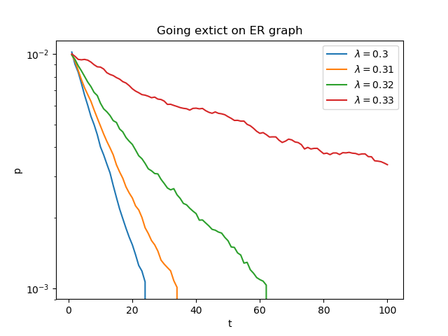
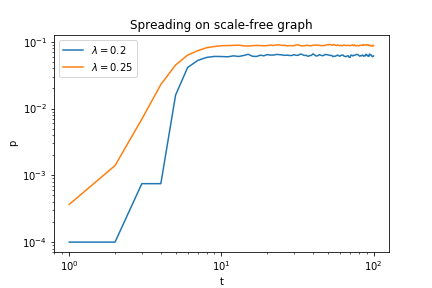

# Course project: Study epidemics numerically in the SIS model on computer generated directed networks.

> Study epidemics numerically in the SIS model on computer generated directed networks. What is the difference between spreading on Erdos- Renyi, and on scale-free networks? In case of scale-free networks, examine whether it makes a difference if only the in- (or out-) degree distribution is scale-free?

> Reproduce the main figures from the following paper: Romualdo Pastor- Satorras, Alessandro Vespignani, “Epidemic dynamics and endemic states in complex networks”, Phys. Rev. E 63, 066117 (2001). 

### Figure1

Supercritical spreading on random networks with exponentially bounded degree distribution.

Reproduced figure            |  Original figure
:-------------------------:|:-------------------------:
 |   

### Figure3

Supercritical spreading on random networks with exponentially bounded degree distribution.

Reproduced figure            |  Original figure
:-------------------------:|:-------------------------:
 |   

### Figure4

Subcritical extinction on random networks with exponentially bounded degree distribution.

Reproduced figure            |  Original figure
:-------------------------:|:-------------------------:
 |    

### Figure9

Supercritical spreading on scale-free random networks.

Reproduced figure            |  Original figure
:-------------------------:|:-------------------------:
 |    
