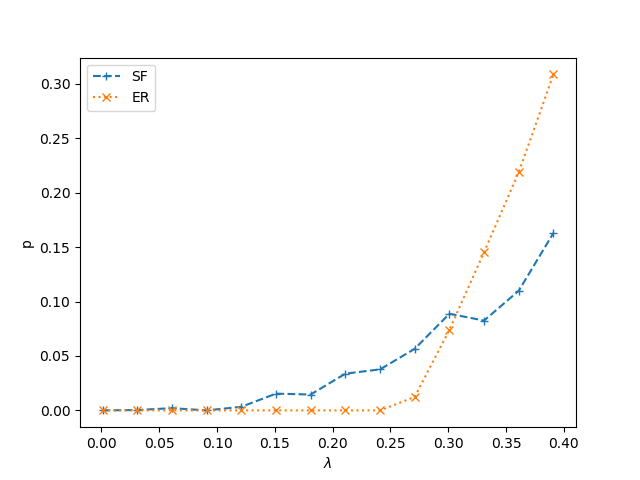
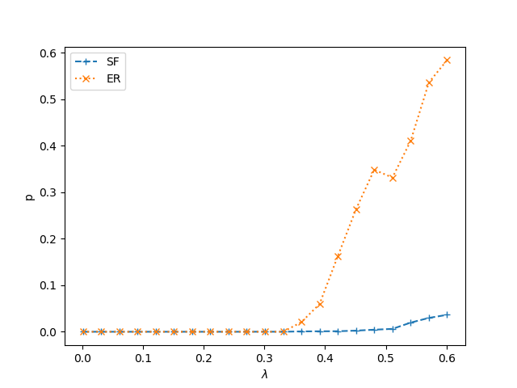
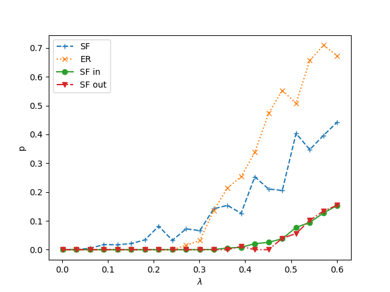

# Course project: Study epidemics numerically in the SIS model on computer generated directed networks.

> Study epidemics numerically in the SIS model on computer generated directed networks. What is the difference between spreading on Erdos- Renyi, and on scale-free networks? In case of scale-free networks, examine whether it makes a difference if only the in- (or out-) degree distribution is scale-free?

> Reproduce the main figures from the following paper: Romualdo Pastor- Satorras, Alessandro Vespignani, “Epidemic dynamics and endemic states in complex networks”, Phys. Rev. E 63, 066117 (2001). 

### The presence and absence of epidemic threshold (Figure1)

Random networks with exponentially bounded degree distributions have a critical value for the spreading rate lambda. If it is lower than the critical value then infections disappear, if it is higher, then a thefinite fraction of the nodes will always be infected, the infection will persist.

Random networks with scale free degree distributions do no have an epidemic threshold, even very weakly spreading infections can became endemic in a large enough network. The stationary fraction of infected nodes smoothly converges to 0 at 0 spreding rate.

When creating a directed graph in-out degree correlations can make large differences, in the follwoing section I consider 2 cases: 1. A node has the same number of in and out edges, 2: No degree correlations at all.

#### With in-out degree correlations

Here I show with <kin> = <kout> = 3 directed networks, the above described behaviour on Erdős-Rényi and scale-free networks. The chance for healing was selected to be 1, similarly to the referenced paper. At <kin/out> = 3, the epidemic threshold is slightly under 1/3, which holds for undirected ER-graph. The curves are the mean fractions of 100 realizations.

Reproduced figure            |  Original figure
:-------------------------:|:-------------------------:
 |   

#### With no dregree correlations

Scale free networks with no degree correlations hinder spreading compared to ER graphs. Its seems like it is basically impossible to get into the out-hubs, and impossible to leave the in-hubs.
The ER graph shows qualitatively similar behaviour to the previous section with epidemic thershold ~1/3 similarly to undirected graphs, and slightly higher than in the correlated version.

##### Notes: 
The networks were created with a configuration model, therefore they are pseudographs, not graphs. This should not be a serious problem in this case. The scale-free networks have power-law, Zipf degree distribution with gamma = 2.2. The average degree was selected to be ~3 simply for conveniance. 

### Supercritical spreading on random networks with exponentially bounded degree distribution (Figure3)

Above the epidemic threshold infections seeded in a single node can spread to a large fraction of the nodes. The initial spreading is an exponential process. 

Here I show the average time dependence of the fraction of infected nodes, just above the epidemic threshold. Each line is the average of a 1000 independent realizations.

Reproduced figure            |  Original figure
:-------------------------:|:-------------------------:
 |   

##### Notes:
No degree correlations in this section.

### Subcritical extinction on random networks with exponentially bounded degree distribution (Figure4)

Under the epidemic threshold infections seeded in a large fraction of nodes disappear with an exponential decay.

Here I show the average time dependence of the fraction of infected nodes, just under the epidemic threshold. Each line is the average of a 1000 independent realizations.

Reproduced figure            |  Original figure
:-------------------------:|:-------------------------:
 |    

##### Notes:
No degree correlations in this section.

### Spreading on scale-free random networks (Figure9)

Scale-free graphs have no epidemic threshold. Even with spreading rates well above the epidemic threshold of an exponentially bound network with the same average degrees, infections seeded in a single node can spread to a large fraction of the nodes. The spreding process is a polynomial.

Reproduced figure            |  Original figure
:-------------------------:|:-------------------------:
 |    

##### Note:
On scale free networks an infection seeded in a single node can easily get trapped and disappear in the first step if it visits a node with 0 outgoing degrees. In order to avoid a spurious drop in the curves, i decided to eliminate runs where the infection disappeared after the first step.

##### Notes:
Perfect in-out degree correlations in this section.

---

# Directed networks with scale-free distribution only in or out degrees

Note that networks in this section have no degree correlations! 

Scale-free in degree distribution only at the incoming degrees reproduces a very similar epidemic threshold, and actually hurts the spreading of infections. This is understandable, as a single node reaches less second neighbors due to the convergence of routes to nodes with high incoming degrees, and these nodes do not have large amount of outgoing degrees.

Scale-free out degree distribution leads to similar behaviour as the above.

Here I show the fractional of nodes reached by the infection depending on the spreading rate.
The results indicate that scale-free distribution is necessary both in out and in degrees in order to overcome the epidemic threshold.

##### Notes:
The 2 different graph types were obtained from each other by reversing the direction of edges.

---

# Conclusions

I studied the behaviour of the SIS model on directed networks with scale-free and exponentially bounded degree distributions, and qualitatitively reproduced the main figures in the Satorras-Vespigniani paper, when in and out degrees were perfectly correlated.

A also inspected the effect of degree correlations, and concluded than correlation is necessary for the disappearence of the epidemic threshold for scale free networks, and correlation facilitates spreading on an ER graph but it does not change qualitative behaviour.

A also inspected the effect of scale-free distributions only appearing in in or our degrees.  SF distribution only in incoming degrees or outgoing degrees slows spreading compared to an ER graph.
