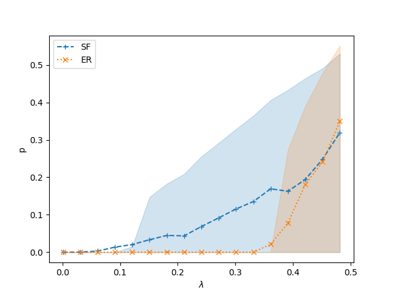
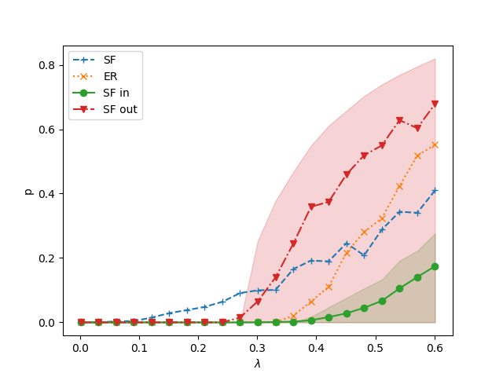
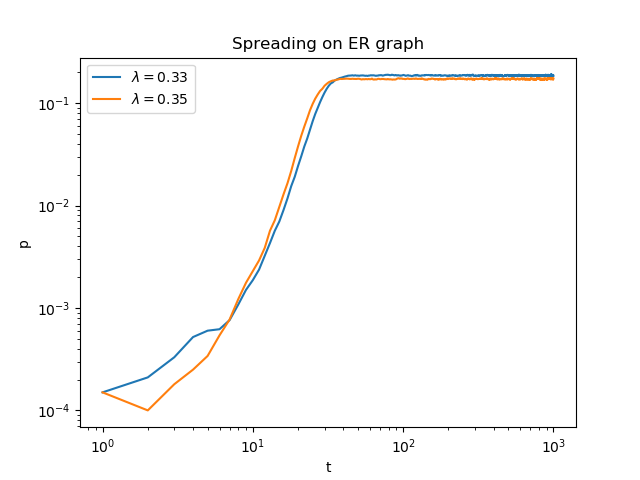

# Course project: Study epidemics numerically in the SIS model on computer generated directed networks.

> Study epidemics numerically in the SIS model on computer generated directed networks. What is the difference between spreading on Erdos- Renyi, and on scale-free networks? In case of scale-free networks, examine whether it makes a difference if only the in- (or out-) degree distribution is scale-free?

> Reproduce the main figures from the following paper: Romualdo Pastor- Satorras, Alessandro Vespignani, “Epidemic dynamics and endemic states in complex networks”, Phys. Rev. E 63, 066117 (2001). 

### The presence and absence of epidemic threshold (Figure1)

Random networks with exponentially bounded degree distributions have a critical value for the spreading rate lambda. If it is lower than the critical value then infections disappear, if it is higher, then a thefinite fraction of the nodes will always be infected, the infection will persist.

Random networks with scale free degree distributions do no have an epidemic threshold, even very weakly spreading infections can became endemic in a large enough network. The stationary fraction of infected nodes smoothly converges to 0 at 0 spreding rate.

Here I show with <kin> = <kout> = 3 directed networks, the above described behaviour on Erdős-Rényi and scale-free networks. The chance for healing was selected to be 1, similarly to the referenced paper. At <kin/out> =3, the epidemic threshold is at 1/3, which is clearly visible for the ER-graph.

Reproduced figure            |  Original figure
:-------------------------:|:-------------------------:
 |   

##### Notes: 
The scale-free networks were created with a configuration model, therefore they are pseudographs, not graphs. This should not be a serious problem in this case. The network has a power-law, Zipf degree distribution with gamma = 2.2. The average degree was selected to be ~3 simply for conveniance. Each node has the same out and in degree.

### Supercritical spreading on random networks with exponentially bounded degree distribution (Figure3)

Above the epidemic threshold infections seeded in a single node can spread to a large fraction of the nodes. The initial spreading is an exponential process. 

Here I show the average time dependence of the fraction of infected nodes, just above the epidemic threshold. Each line is the average of a 1000 independent realizations.

Reproduced figure            |  Original figure
:-------------------------:|:-------------------------:
 |   

### Subcritical extinction on random networks with exponentially bounded degree distribution (Figure4)

Under the epidemic threshold infections seeded in a large fraction of nodes disappear with an exponential decay.

Here I show the average time dependence of the fraction of infected nodes, just under the epidemic threshold. Each line is the average of a 1000 independent realizations.

Reproduced figure            |  Original figure
:-------------------------:|:-------------------------:
 |    

### Spreading on scale-free random networks (Figure9)

Scale-free graphs have no epidemic threshold. Even with spreading rates well above the epidemic threshold of an exponentially bound network with the same average degrees, infections seeded in a single node can spread to a large fraction of the nodes. The spreding process is a polynomial.

Reproduced figure            |  Original figure
:-------------------------:|:-------------------------:
 |    

##### Note:
On scale free networks an infection seeded in a single node can easily get trapped and disappear in the first step if it visits a node with 0 outgoing degrees. In order to avoid a spurious drop in the curves, i decided to eliminate runs where the infection disappeared after the first step.

---

# Directed networks with Scale-free distribution only in or out degrees

Scale-free degree distribution only at the incoming degrees reproduces a very similar  epidemic threshold, and actually hurts the spreadin of infections. This is understandable, as a single node reaches less second neighbors due to the convergence of routes to nodes with high incoming degrees, and these nodes do not have large amount of outgoing degrees.
(Note that scale free degree distributions with uncorrelated in-out degrees lead to the same behaviour, this is not shown here).

Scale-free degree distribution only at the ougoming degrees leads to an intermediate behaviour between scale-free and bounded networks. While scale free out degree distributions help spreading from the 'half hubs', the bounded in degree distribution prevents the effective reaching of these 'half hubs'.

Here I show the fractional of nodes reached by the infection depending on the spreading rate.

Here I show supercritical spreading the fractional of nodes reached by the infection depending on the spreading rate.

